# CareFlow AI — System Architecture

> Implementation-grounded architecture reference. Verified against `backend/app/**`, `frontend/apps/**`, `infra/*`, `backend/Dockerfile`, `backend/start.sh`, `railway.toml`, and Alembic migrations. No hypothetical services are documented.

| Property | Implementation |
|---|---|
| Architecture Style | Modular monolith (`backend/app/main.py` + 22 routers) |
| Frontend | 5 React 18 + Vite 5 SPAs (role-scoped) |
| Backend | FastAPI + Pydantic v2 + SQLAlchemy 2.0 + Alembic (23 migrations) |
| Database | PostgreSQL 16 (SQLite only in tests) |
| Async Processing | Celery 5.4 + Redis 7 + Celery Beat (hourly sweep) |
| AI | Tool-calling agent (Inception preferred, Groq fallback) — **not RAG** |
| Capability Boundary | Custom in-process MCP layer (20 tools) |
| Integration | Connector-protocol EHR integration (Mock EHR bundled) |
| Authentication | JWT (HS256) + Argon2 + RBAC + hospital-scoped tenancy |
| Deployment | Vercel (frontend) + Railway all-in-one container (backend) |

## Architecture at a Glance

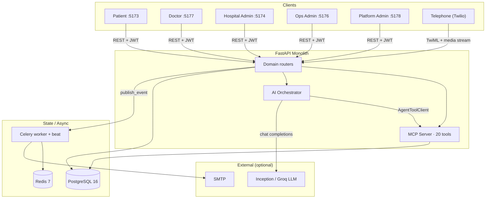

## Request Lifecycle

Every authenticated REST call follows the same path: CORS → correlation ID → JWT context (DB-reloaded) → role check → router → service → PostgreSQL / integration / event bus → response.

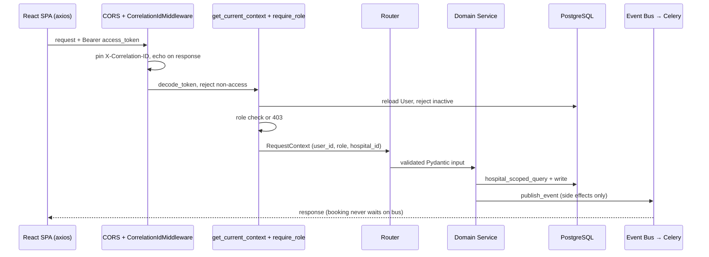

Source: `app/main.py` (middleware + 22 routers), `app/core/deps.py:29-68`, `app/observability/correlation.py`, `app/workflow/event_bus.py` ("Booking is never held hostage by the bus").

## Technology Stack

| Layer | Technology | Purpose |
|---|---|---|
| Frontend | React 18 + Vite 5 + TS, react-router v7, axios, Tailwind 3, framer-motion, lucide | 5 role-scoped SPAs |
| Backend | FastAPI 0.115+, Pydantic v2, SQLAlchemy 2.0, Alembic | Modular monolith API |
| Database | PostgreSQL 16 + psycopg2; SQLite only in tests | Tenant-scoped transactional truth |
| Auth | PyJWT (HS256) + argon2-cffi, OAuth2PasswordBearer | Access (2d) + refresh (2d), RBAC |
| AI | httpx → Inception `mercury-2.5` (preferred) / Groq `openai/gpt-oss-20b`; custom MCP (20 tools); Redis AIContext (TTL 2h) | Tool-calling scheduling assistant |
| Voice | WS (WebRTC) + Twilio media streams; Stub STT default, Groq Whisper optional (3-attempt 429/5xx retry); browser Web Speech TTS for chat (server Orpheus removed) | Web + telephone channel |
| Async | Celery 5.4 + Redis broker/backend, supervisord/beat | Workflow events, reminders, EHR retries |
| Integration | `EHRConnector` protocol + Mock EHR module | Swappable EHR stand-in |
| Infra | docker-compose (local), Railway + Vercel (prod); no CI/CD | Dev / prod hosting |
| Observability | CorrelationIdMiddleware, `tracing.span`, audit + capability tables | Tracing, metrics, audit |

## Architecture Layer View

| Layer | Responsibility | Key Modules |
|---|---|---|
| Presentation | Role-scoped user interaction | `frontend/apps/{patient,doctor,hospital-admin,operations-admin,platform-admin}` |
| API | HTTP/WebSocket interface, auth, tenancy | `app/main.py`, domain `router.py` files, `core/deps.py`, `voice/router.py` |
| Domain | Business logic, state machine, slot calc | Domain `service.py` files (`appointment`, `scheduling`, `doctor`, `hospital`, …) |
| Capability | Controlled AI actions | `app/mcp_server/{server,tools×20,middleware}` |
| Agent | Conversation loop + guards + context | `app/ai/{router,agent/orchestrator,context,mcp_client}` |
| Integration | External-system abstraction | `app/integration/*`, `app/reliability/{verification,synchronization,reconciliation}` |
| Workflow | Async events, retries, reminders | `app/workflow/{event_bus,celery_app,tasks}` |
| Data | Relational persistence | PostgreSQL via `app/core/db.py`, Alembic `0001–0023` |
| Context | Short-lived AI state + queue | Redis (`careflow:ai-context:`, Celery broker) |
| Observability | Tracing, metrics, audit | `app/observability/*`, `audit_events`, `capability_executions` |

## High-Level Architecture

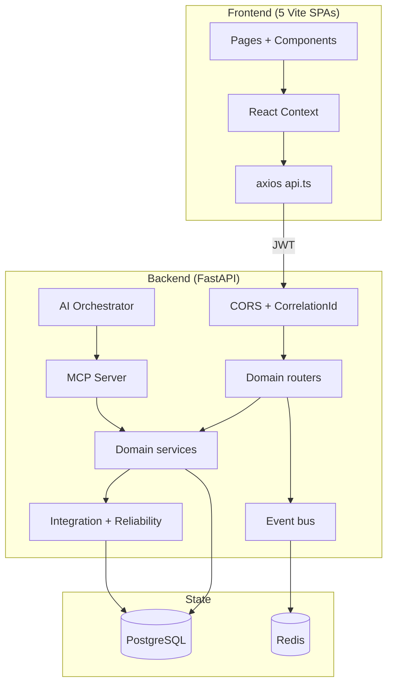

Module map: `api/health` · `core/{config,security,deps,db,audit,tenant}` · `domain/{auth,appointment,doctor,hospital,hospital_config,patient,questionnaire,scheduling,directory}` · `integration/{connector_interface,integration_service,mock_ehr,mapping}` · `mcp_server/{server,escalations,tools×20,middleware}` · `ai/{router,agent/orchestrator,context,mcp_client}` · `notification` · `workflow/{event_bus,celery_app,tasks}` · `reliability/{verification,synchronization,reconciliation}` · `voice/{router,telephony,web_voice}` · `observability/{correlation,tracing,metrics}`.

## Frontend Architecture

* **Structure:** 5 independent Vite apps (`frontend/apps/*`), no monorepo tooling. `frontend/shared/` is scaffolding only — nothing in `apps/*/src` imports it.
* **Entry:** `index.html` → `src/main.tsx` → `src/App.tsx` (`BrowserRouter` → `Routes` → `ProtectedLayout` guard → `<Navigate to="/login">`).
* **State:** React Context only (`AuthContext`, `AppStateContext` / `ScheduleContext` / `AdminStore`). No zustand/redux.
* **API:** per-app `src/api.ts` → `axios.create({ baseURL: VITE_API_URL ?? "https://careflow-ai-production.up.railway.app" })`; dev `VITE_API_URL=http://localhost:8000`. `POST /mcp/call {tool, input}` is used for search/availability helpers; voice derives `wsBase` from `baseURL`.
* **Auth:** per-app `localStorage` token keys (e.g. `careflow_patient_token` + `*_refresh`); `Authorization: Bearer`; single silent refresh on 401 via `POST /auth/refresh`; boot restores via `GET /auth/me`; per-app role enforcement (hospital-admin requires `hospital_admin`, platform-admin requires `platform_admin`).
* **Voice loop (patient):** `voice/useWebRTCAudio.ts` (mic capture → `WS /voice/ws`) + `voice/useSpeechSynthesis.ts` (chat replies read aloud via browser `window.speechSynthesis`, no server TTS call).

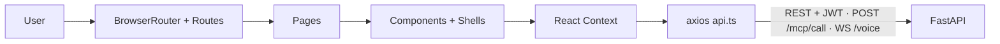

Key routes: **patient** `/, /book, /visits, /inbox, /chat, /chat-debug, /voice, /preferences, /profile` · **doctor** `/, /today, /upcoming, /calendar, /availability, /appointments/:id, /questionnaires, /notifications, /profile` · **hospital-admin** `/, /setup, /catalog/*, /doctors, /appointments, /questionnaires, /ai-activity, /integration, /workflows, /analytics, /staff, /ops/*` · **operations-admin** `/ops/*` only · **platform-admin** `/platform/*`.

## Backend Architecture

`app/main.py` builds `FastAPI(title="CareFlow AI")`, adds CORS + `CorrelationIdMiddleware`, mounts **22 routers**. Per-domain pattern: `router.py` (paths + `require_role` + `hospital_scoped_query`) → `service.py` (slot calc, state machine, lifecycle) → `models.py` + `schemas.py`. No separate repository layer; FK-only relationships (no `relationship()`).

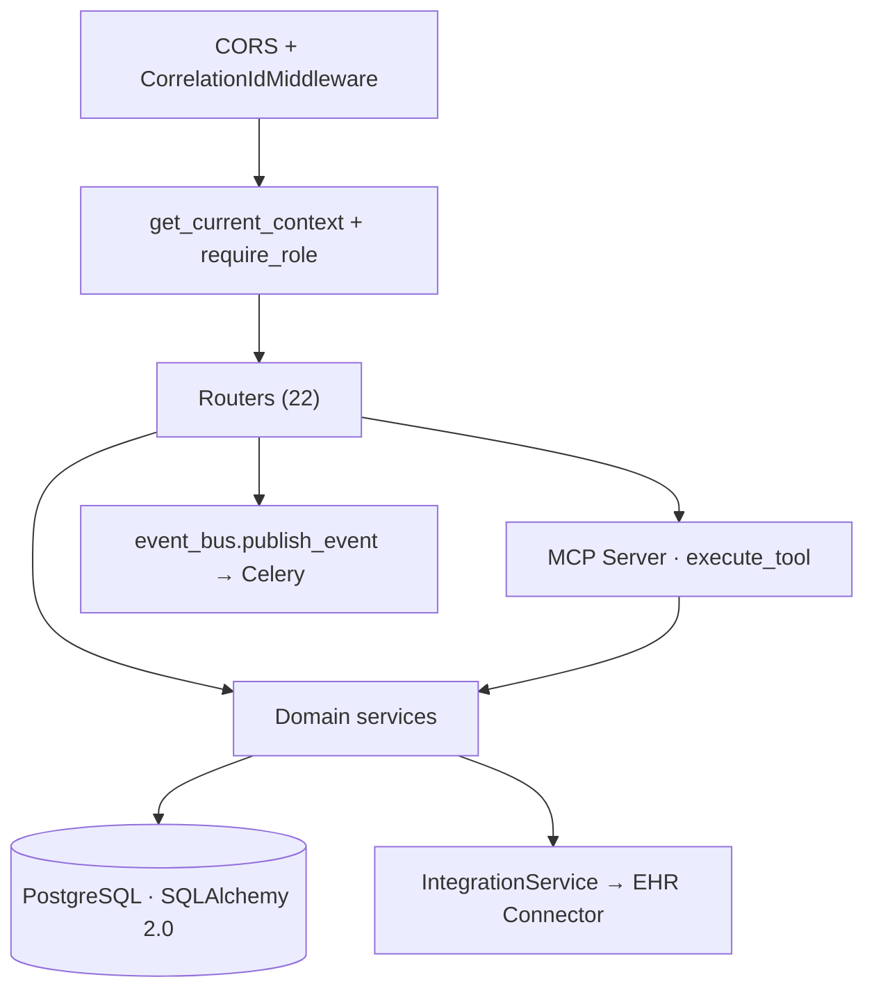

| Area | Endpoints |
|---|---|
| Auth | `POST /auth/register\|/login\|/refresh`, `GET /auth/me`, `GET /auth/platform-ping` |
| Appointments | `POST/GET /appointments`, `GET /appointments/{id}`, `POST .../reschedule\|/cancel\|/complete\|/no-show\|/confirm` |
| Scheduling | `GET/PUT /hospitals/{hid}/doctors/{did}/calendar`, `.../availability-rules[/{rid}]`, `.../blocked-slots[/{bid}]`, `GET .../slots` |
| Doctors / Hospitals | `GET/POST /hospitals/{id}/doctors` + lifecycle (`activate/deactivate/suspend/invite/login`); `POST /hospitals`; platform `POST /platform/hospitals/{id}/{approve,reject,suspend,reinstate,start-review,request-corrections}` |
| AI / MCP | `POST /chat`, `GET /mcp/tools`, `POST /mcp/call`, `GET /escalations`, `POST /escalations/{id}/resolve` |
| Ops | `GET /reconciliation/records`, `POST .../{id}/{retry,resolve}`, `GET /operations`, `POST /operations/{id}/retry`, `GET /workflows` |
| Observability | `GET /observability/trace/{cid}`, `GET /observability/metrics` |
| Voice | `WS /voice/ws`, `WS /voice/telephony/media`, `POST /voice/telephony/inbound` (TwiML) + `/status` |

## Database Architecture

PostgreSQL 16, `Base` in `app/core/db.py` (`JSONB` with SQLite variant for tests), Alembic `0001–0023`. Only architecturally meaningful entities are shown.

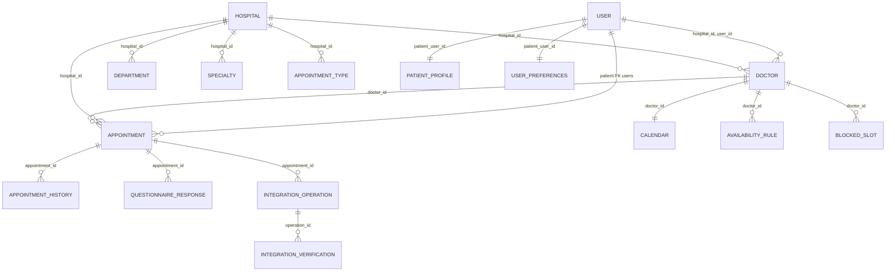

Key columns/constraints: `users(role: platform_admin|hospital_admin|doctor|patient, hospital_id nullable, is_active)` · `hospitals(status: draft/submitted/under_review/approved/rejected/suspended)` · `doctors(status: invited/active/inactive/suspended, external_provider_id)` · `patient_profiles(photo_url Text, nullable; migration 0023)` · `appointments(state: 10 values, idempotency_key unique, external_id, correlation_id; default pending)` · `appointment_history(from/to_state, actor)` · `notifications(dedupe_key unique)` · `capability_executions(tool, latency, correlation_id)` · `reconciliation_records(resolution_status: open/retrying/resolved/escalated)`. Indexing priorities: `hospital_id`, `(doctor_id, date)`, `correlation_id`, `idempotency_key`.

## Authentication & Authorization

JWT (PyJWT, HS256) + Argon2. Access `{sub, role, hospital_id, type:access, exp=now+2d}`; refresh `{sub, type:refresh, exp=now+2d}`. `OAuth2PasswordBearer(tokenUrl="/auth/login")` → `get_current_context()` rejects non-`access` tokens, reloads the `User` row, rejects inactive → `require_role(*roles)` returns 403. No sessions, no SSO.

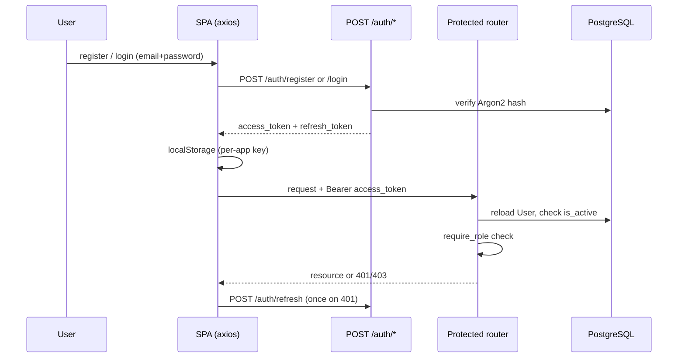

## Multi-Tenant Data Isolation

The DB user row is authoritative: `get_current_context()` (`app/core/deps.py:52-57`) builds scope from the reloaded `User`, ignoring the token's `hospital_id` claim. `hospital_scoped_query()` (`app/core/tenant.py`) filters every tenant query; only `platform_admin` bypasses.

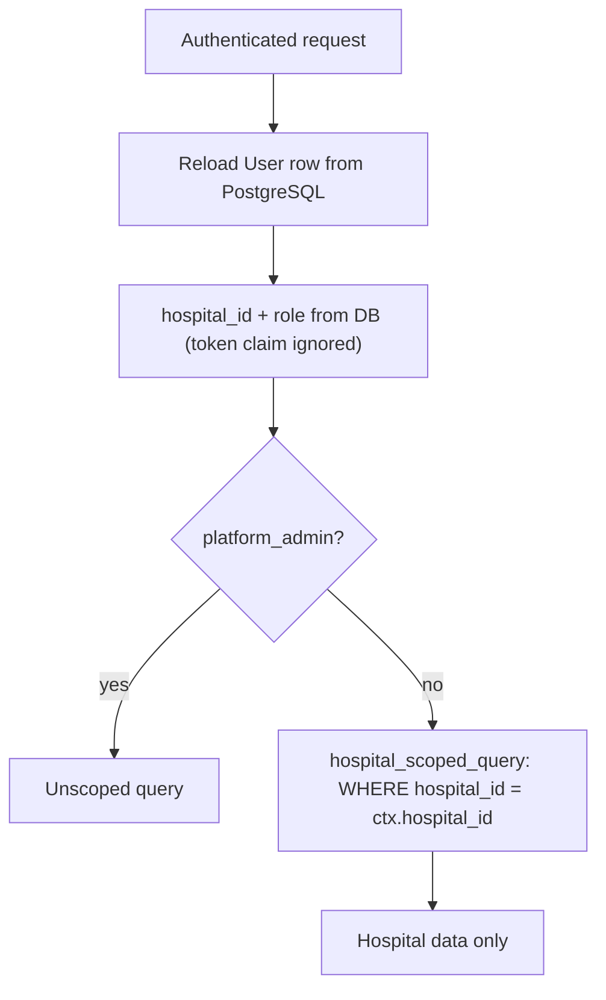

## Data Ownership

| Data | Source of Truth | Storage |
|---|---|---|
| Users, roles, hospital membership | Application | PostgreSQL (`users`) |
| Hospital config (departments, specialties, types) | Application | PostgreSQL |
| Doctor calendars, rules, blocked slots | Application | PostgreSQL |
| Appointment state | Application (`Appointment`; EHR is verified against, not authoritative) | PostgreSQL + `appointment_history` |
| External appointment record | EHR (via Connector) | Mock EHR (+ `external_identifier_mappings`) |
| Verification / sync outcome | Application (trust-but-verify re-read) | `integration_verifications`, `integration_operations` |
| Recovery queue | Application | `reconciliation_records` in PostgreSQL |
| AI conversation context | AI context store | Redis `careflow:ai-context:` (TTL 2h, dict fallback) |
| Async queue + results | Celery | Redis broker/backend; `workflow_executions` in PostgreSQL |
| Notifications | Application | PostgreSQL (`notifications`, `dedupe_key` unique) |
| Audit / capability trail | Application | `audit_events`, `capability_executions` |

## Core Business Flows

### Booking — search → availability → review → create → async handling

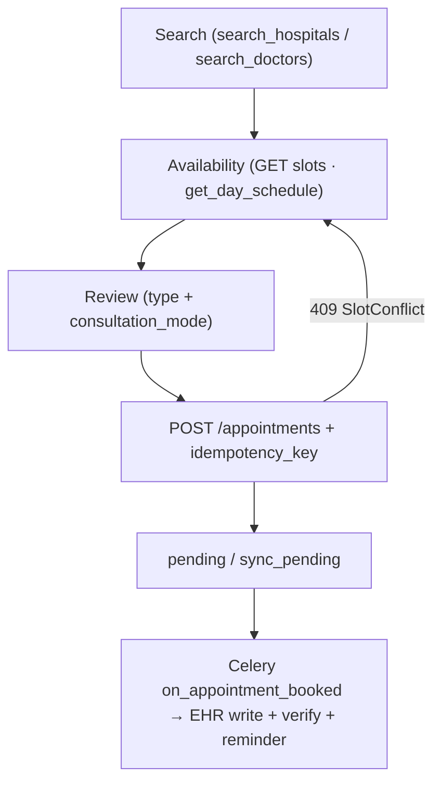

Direct-booking writes go through `scheduling.reserve_slot` (calendar `FOR UPDATE` lock + overlap check + `UNIQUE(doctor_id,start,end)` backstop → `SlotConflictError` → 409). Range cap `MAX_RANGE_DAYS=62`.

### Appointment lifecycle (actual `AppointmentState`, 10 values)

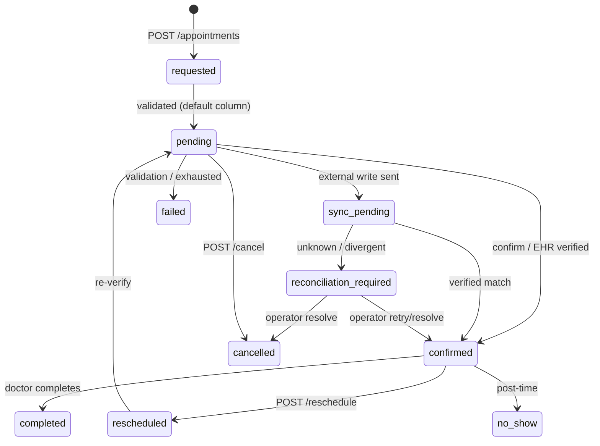

Every transition writes `appointment_history` with `correlation_id` + actor.

### Hospital onboarding

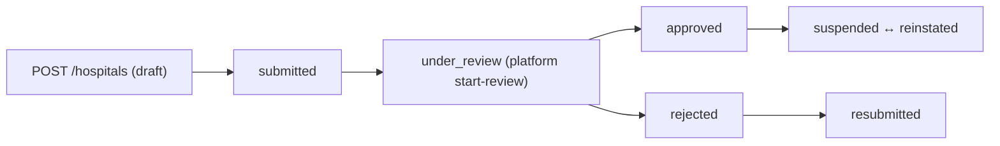

### Questionnaire

Hospital-scoped definitions (`POST/GET /hospitals/{id}/questionnaires`, scoped by hospital/specialty/doctor/appointment-type) → patient answers via `GET /appointments/{id}/questionnaire` + `POST .../responses` → doctor inbox `GET /doctors/me/questionnaire-responses`. Diagnostic interpretation is forbidden by design.

## AI Architecture (tool-calling — NOT RAG)

No embeddings, chunking, vector DB, or retrieval exist in the codebase. The assistant is a deterministic-guarded tool-calling loop over an OpenAI-compatible chat API.

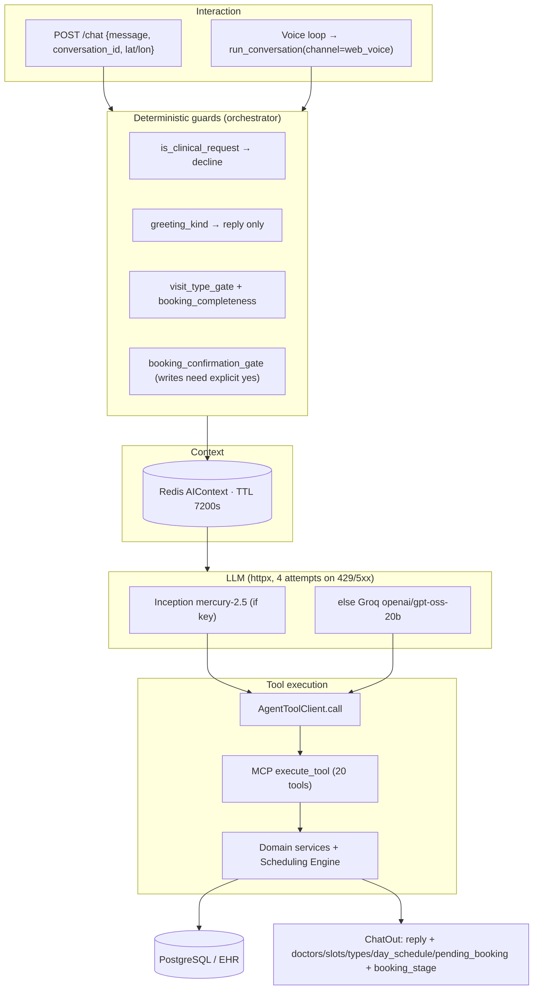

Notes: `MAX_ITERATIONS=8`; conversation memory is the structured `AIContext` (~25 fields: selection, offered lists, `last_search`, `pending_booking`, `awaiting_confirmation`, capped 20-turn history) — not a transcript blob; system prompt enforces scheduling-only boundary, IST handling, and one-step-at-a-time booking (doctor→day→type→mode→time→confirm). Web-voice turns pass `channel="web_voice"` (per-turn `WEB_VOICE_PROMPT`, never persisted) so replies are short spoken sentences. `POST /mcp/call` exposes the same tools to operators/ChatDebug. MCP is custom in-process code, not the MCP protocol SDK.

## AI Safety & Capability Boundary

The agent has **no database or EHR access**. All facts and writes flow through the tool wrapper (`app/mcp_server/tools/_base.py:54-95`), which enforces auth → idempotency → bounded retry → audit on every call. Write confirmation lives one layer up, in the orchestrator's `_booking_confirmation_gate` — the tools themselves do not implement confirmation.

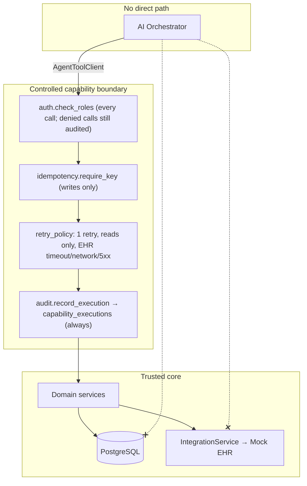

Patient self-booking is additionally constrained inside the tool (`create_appointment.py:47-48`: patients may only book for their own `user_id`). DB-level `UNIQUE(idempotency_key)` backstops the idempotency check.

## Background Processing

Celery + Redis only — no FastAPI `BackgroundTasks`. `publish_event()` persists `WorkflowExecution(status=running)` then `handle_event.delay()` (acks-late, never raises). Hourly `beat` (`careflow.sweep_tick`) publishes `reminder.sweep` + `reconciliation.sweep`.

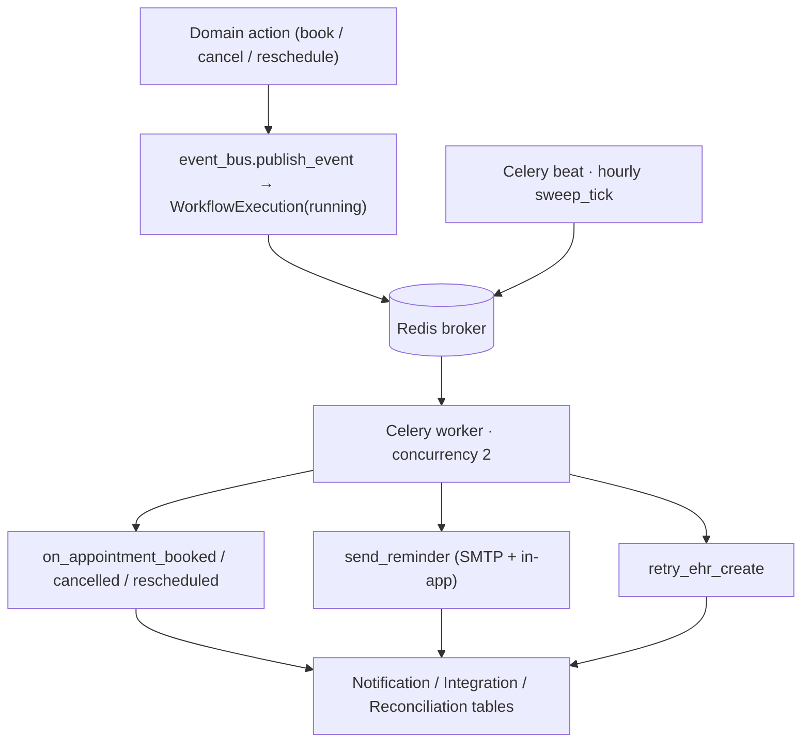

Local compose runs `worker` + `beat` as separate containers; Railway runs api + worker + beat under supervisord in one container.

## Failure & Recovery Flow

Trust-but-verify: every vendor "success" is re-read (`verify_external_appointment`, 2 read attempts) before it counts. Unknown outcomes are never blindly retried — the reconciler looks up by `idempotency_key` first, then parks or fails explicitly.

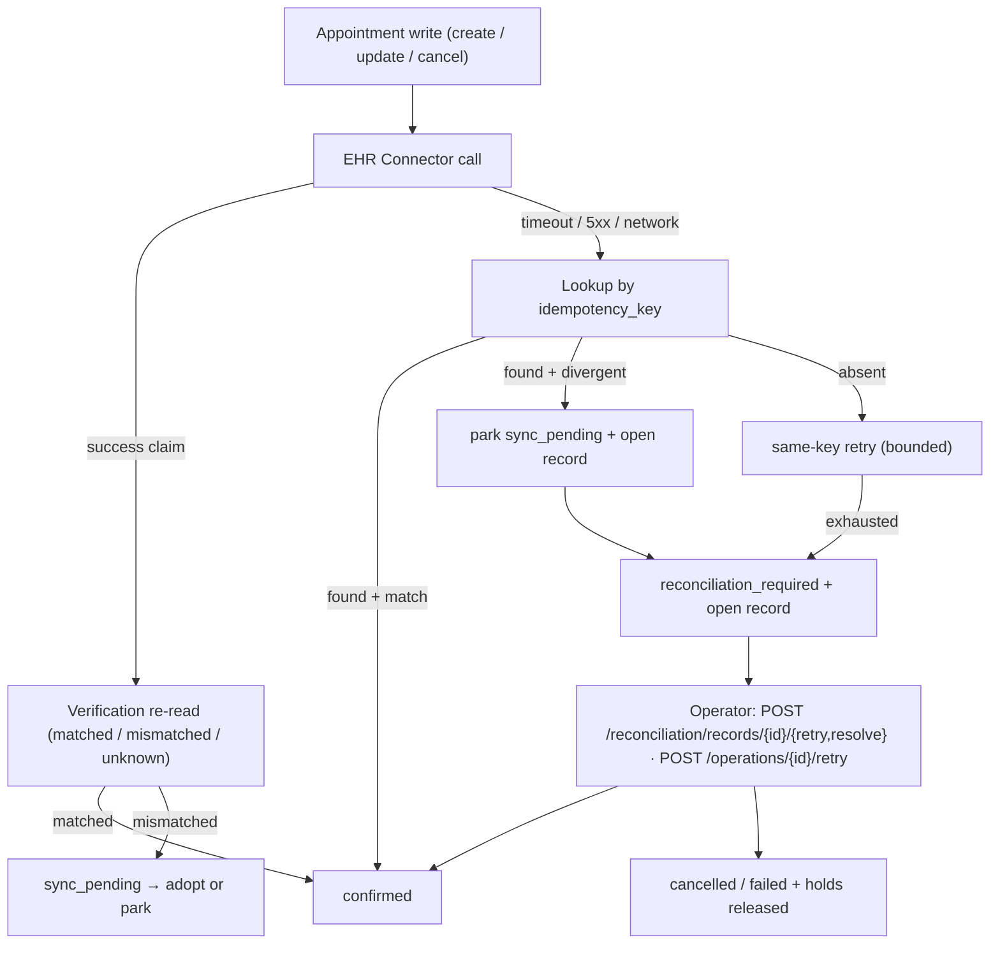

Holds: `reserve_slot` inserts `BlockedSlot` rows as locks; recovery releases the correct hold (`release_appointment_hold`) once vendor truth is known. `EHRValidationError` (4xx) → `failed` immediately, never retried.

## External Integrations

| Integration | Used By | Purpose | Required |
|---|---|---|---|
| Inception API (`INCEPTION_API_KEY`, `mercury-2.5`) | `ai/agent/orchestrator._chat_backend` | Preferred chat model | Optional (falls back to Groq) |
| Groq API (`GROQ_API_KEY`/`LLM_API_KEY`) | orchestrator fallback; Whisper STT | `openai/gpt-oss-20b` chat; Whisper STT (3-attempt 429/5xx retry, temperature=0, language=en) | Optional (chat 503/502 without keys) |
| Browser Web Speech API | patient `voice/useSpeechSynthesis.ts` | Chat replies read aloud client-side; no server TTS call | Built-in (no key) |
| Twilio Voice | `voice/telephony/*` | Inbound calls: HMAC-SHA1 validation (only when token set), TwiML `<Connect><Stream>`, media-stream WS | Optional (503 when `TELEPHONY_STREAM_URL` empty) |
| SMTP (`SMTP_HOST/PORT/FROM`, default `localhost:1025`) | `notification/service` via workflow tasks | Email delivery via `smtplib`; in-app path writes `sent` rows directly | Optional/dev |
| Mock EHR (`EHR_MOCK_BASE_URL`, fault injection) | `integration/*` via `EHRConnector` protocol | Stand-in patients/providers/appointments; swappable by passing another connector | Bundled |
| Vercel / Railway | Frontend apps / backend container | Static hosting / container hosting | Prod only |

No secrets in the repo (`.env` gitignored; only `.env.example` checked in).

## Deployment Architecture

### Local Development (`infra/docker-compose.yml`)

Vite dev servers (hospital-admin, doctor) + split backend (`ALL_IN_ONE=false`) with dedicated worker/beat containers against compose Postgres/Redis. The patient SPA was removed from compose (run via local `npm run dev`); `docker-compose.alt-ports.yml` shifts ports (`8001/6380/5179+`) when the defaults clash.

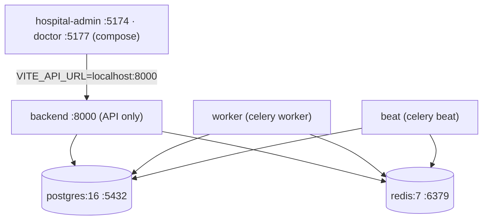

### Production (Railway + Vercel)

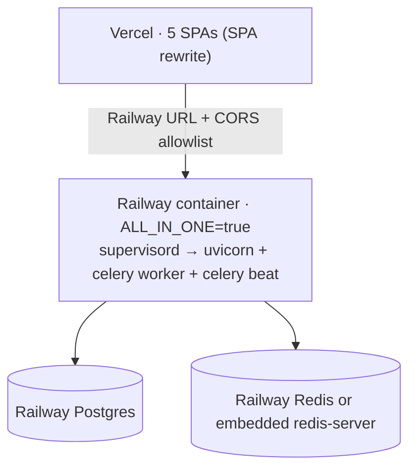

`backend/Dockerfile` (`python:3.13-slim` + `redis-server` + `supervisor`) → `CMD ./start.sh`: normalizes `DATABASE_URL` (incl. Neon `channel_binding` strip), boots embedded Redis when needed, TCP-waits Postgres, widens `alembic_version`, retries `alembic upgrade head` 10×, then supervisord (or bare uvicorn when `ALL_IN_ONE=false`). `railway.toml`: Dockerfile builder, `healthcheckPath=/health`, restart `ON_FAILURE×10`. No CI/CD (no `.github/workflows`).

## Security Architecture

* **AuthN:** Argon2 hashing; JWT HS256 access+refresh (2d/2d); per-request DB user reload; inactive rejection; no sessions/SSO.
* **AuthZ:** `require_role()` on routers; `allowed_roles` on all 20 MCP tools (denied calls still audited); patient self-booking constraint in write tools.
* **Tenancy:** `hospital_scoped_query`; token `hospital_id` is a hint only; `platform_admin` is the sole bypass.
* **Input/transport:** CORS allowlist; Pydantic validation on every router/tool input; email-validator; phone digit-normalization; Twilio HMAC-SHA1 check (when token configured).
* **Write safety:** orchestrator confirm-gate on booking writes; `idempotency_key` required on writes + DB unique backstop; slot reservation under `FOR UPDATE` lock; EHR writes verified before confirm.
* **Secrets:** env-only via `pydantic-settings`; `.env` gitignored.

## Observability & Error Handling

* `CorrelationIdMiddleware` pins `X-Correlation-ID` per request and echoes it; deterministic `uuid5` IDs per conversation; `operation_id` per capability execution.
* `tracing.span()` writes one `AuditEvent(action="observability.span")` per block (duration, attrs, error) — never raises.
* Metrics are plain aggregate queries (no pipeline): bookings by state, reconciliation queue depth, `chat.turn` latency (count/avg/p50/p95/max) + per-tool calls/avg from `CapabilityExecution`, workflows/notifications/escalations overview.
* Audit trail: `audit_events` (sensitive actions) · `capability_executions` (every tool call) · `appointment_history` (every transition) · `GET /observability/trace/{cid}`.
* Error mapping: validation → 422 · unauth → 401 · forbidden → 403 · slot conflict → 409 · LLM vendor failure → 502 · missing AI keys → 503 · unknown EHR outcome → `reconciliation_records` + operator retry/resolve.
* Tests: 30+ pytest files (SQLite + `TestClient`, `TASK_EAGER` eager mode) + Playwright e2e (`tests/e2e`).

## Architecture Principles

* Modular monolith: one deployable, per-domain routers/services (`main.py` + 22 routers).
* Database-backed transactional truth; external claims verified before confirm.
* Tool-mediated AI: the agent acts only through validated, audited capabilities.
* Explicit tenant isolation from the DB row, never from client input.
* Idempotent appointment writes (key required + unique backstop + slot locks).
* Async side effects via persistent workflow rows + Celery, never inline blocking.
* External systems behind an abstraction (`EHRConnector` protocol).
* Auditable sensitive operations (audit, capability, history tables).

## Architectural Decisions

| Decision | Evidence | Rationale |
|---|---|---|
| Modular monolith | `app/main.py`, 22 routers, per-domain modules | Rationale not explicitly documented in repository. |
| PostgreSQL + SQLAlchemy 2.0 + Alembic | `core/db.py`, domain `models.py`, 23 migrations | Rationale not explicitly documented in repository. |
| JWT (HS256) + Argon2 + RBAC | `core/security.py`, `core/deps.py` | Rationale not explicitly documented in repository. |
| Custom in-process MCP tools (not MCP SDK / LangChain) | `mcp_server/server.py`, `tools/_base.py`, `middleware/*` | Per-tool RBAC + idempotency + audit + bounded retry in one wrapper. |
| Tool-calling agent instead of RAG | `ai/agent/orchestrator.py`, zero vector-code hits | Scheduling facts come from live DB/EHR tools, not documents. |
| Redis for AIContext + Celery broker | `ai/context/ai_context.py`, `workflow/celery_app.py` | One infra for 2h conversation memory and async queue. |
| Celery + beat (not BackgroundTasks/Kafka) | `workflow/event_bus.py`, `celery_app.py`, `tasks/*` | Persistent `WorkflowExecution` rows + retries + hourly sweeps. |
| Mock EHR behind Connector protocol | `integration/connector_interface.py`, `mock_ehr/*` | Swappable vendor; only `IntegrationService` calls connectors. |
| 5 separate Vite SPAs | `frontend/apps/*`, per-app ports/keys/routes | Rationale not explicitly documented in repository. |
| Railway all-in-one + Vercel | `Dockerfile`, `start.sh`, `supervisord.conf`, `railway.toml`, per-app `vercel.json` | Single container (api+worker+beat) with embedded-Redis fallback; static frontend hosting. |
| Browser speech synthesis over server TTS for chat | `useSpeechSynthesis.ts`, `tts_provider.py` (Orpheus removed) | No external TTS request for chat replies; server TTS interface kept only for WS/telephone loops. |

## Current Implementation Status

| Area | Status |
|---|---|
| Authentication (JWT + RBAC + tenant scoping) | Implemented |
| Database (PostgreSQL, 23 migrations) | Implemented |
| Scheduling engine (rules, blocks, slot calc, 62-day window, locks) | Implemented |
| Appointments + state machine + history | Implemented |
| AI assistant (tool-calling, orchestrator confirm gates) | Implemented |
| MCP server (20 tools, RBAC + idempotency + audit) | Implemented |
| Voice (WebRTC WS + Twilio; Whisper STT retry, browser TTS) | Implemented |
| Patient profile photo (`photo_url`, migration 0023) | Implemented |
| EHR integration (mock + verify/sync/reconcile) | Implemented |
| Background processing (Celery + beat + sweeps) | Implemented |
| Notifications (email via SMTP + in-app, dedupe keys) | Implemented |
| Hospital onboarding lifecycle + dashboards | Implemented |
| Questionnaires | Implemented |
| Deployment (compose + Railway + Vercel) | Implemented |