# CareFlow AI

**Multi-tenant healthcare appointment scheduling platform with an AI scheduling assistant, voice/telephone channels, and role-scoped web applications.**


CareFlow AI is a full-stack appointment scheduling system for hospitals, doctors, and patients. It combines a modular FastAPI monolith, five role-scoped React SPAs, a deterministic-guarded tool-calling AI assistant (text chat, web voice, and Twilio telephone), a connector-protocol EHR integration with trust-but-verify reliability, and Celery-based background workflows — all documented in [`Architecture.md`](Architecture.md), which is the authoritative architecture reference for this repository.

---

## Live Applications

| Application | Purpose | Live |
|---|---|---|
| Patient | Doctor discovery, real-availability booking, visits, inbox, AI chat, voice assistant, preferences, profile | [Open](https://careflowpatient.vercel.app/) |
| Doctor | Daily agenda, upcoming visits, calendar, availability rules, appointment detail, questionnaires, notifications, profile | [Open](https://careflow-doctor.vercel.app/login) |
| Hospital Admin | Hospital setup, catalog (departments/specialties/appointment types), doctors, appointments, questionnaires, AI activity, EHR integration, workflows, analytics, staff, ops/recovery | [Open](https://careflow-hospitaladmin.vercel.app/) |
| Platform Admin | Platform-wide oversight: hospital applications/onboarding, hospitals, doctors, patients, appointments, AI, integrations, workflows, analytics, audit, operational health | [Open](https://careflow-platformadmin.vercel.app/platform) |

> A fifth SPA, **Operations Admin** (`frontend/apps/operations-admin`, `/ops/*` views), exists in the codebase but has no public deployment listed above. The production API backing all apps is `https://careflow-ai-production.up.railway.app` (the compiled-in fallback in each app's `src/api.ts` when `VITE_API_URL` is unset).

---

## Overview

**Problem.** Coordinating care across hospitals, doctors, and patients typically means phone queues, stale availability, double bookings, unverified external records, and no safe after-hours channel for patients.

**What CareFlow AI does.** It provides one scheduling truth (PostgreSQL) behind four deployed role-scoped applications, with:

- Real availability computed from doctor calendars, weekly availability rules, and blocked slots (62-day window), with race-safe reservation (`FOR UPDATE` lock + unique backstop → HTTP 409 on conflict).
- A 10-state appointment lifecycle with full history, EHR verification before confirmation, and an operator recovery queue for unknown/divergent outcomes.
- A scheduling-only AI assistant that acts exclusively through 20 audited capability tools — never direct DB/EHR access — over text chat, browser voice, and Twilio telephone.
- Hospital onboarding governed by a platform review lifecycle, and strict hospital-scoped multi-tenancy enforced from the reloaded DB row.

**Why multiple applications?** Each role has a distinct workflow, auth boundary, token store, and route set. Separate Vite SPAs (`frontend/apps/*`) keep patient, doctor, hospital-admin, operations, and platform concerns independently deployable on Vercel while sharing one backend and one database.

---

## Key Features

### Patient (`frontend/apps/patient`)

- Home dashboard with care search, location-aware nearby care, recommended doctors/hospitals, and upcoming appointment summary.
- Doctor/hospital discovery (`search_doctors`, `search_hospitals`) with specialty, mode (in-person/video/phone), and geo filters.
- 3-step booking wizard: doctor → day → appointment type → consultation mode → time → explicit confirmation.
- Real availability: slot grids, day strips, and per-day schedules served from the scheduling engine.
- Visits management: view details, reschedule, cancel, complete-questionnaire prompts.
- Inbox (notifications) and notification preferences.
- AI Assistant chat with structured widgets (doctor cards, slot grids, type/mode selectors, confirm panels) plus a chat-debug view.
- Voice assistant page: live microphone session over `WS /voice/ws` with VAD, barge-in, demo turn, and browser speech synthesis for replies.
- Profile management including profile photo (`photo_url`).
- Questionnaire responses per appointment with concern-flag escalation (no diagnostic interpretation by design).

### Doctor (`frontend/apps/doctor`)

- Overview dashboard: today's appointments, next appointment, completed counts, upcoming-week load, pre-visit form status.
- Today / Upcoming agendas with consultation-mode and questionnaire badges.
- Calendar day view with working-hours band and click-empty-time-to-block behavior.
- Availability management: calendars, weekly availability rules, blocked slots.
- Appointment detail: confirm / complete / no-show transitions plus questionnaire answers (read-only).
- Questionnaire inbox (`GET /doctors/me/questionnaire-responses`).
- Notifications and profile.

### Hospital Admin (`frontend/apps/hospital-admin`)

- Guided hospital setup and registration (`/setup`, `/register`).
- Catalog management: departments, specialties, appointment types.
- Doctor lifecycle: invite, activate/deactivate/suspend, login-as support.
- Appointments oversight, questionnaire definitions, AI-activity review.
- EHR integration status, workflow executions, analytics dashboards, staff management.
- Ops/recovery views: failed operations, unknown outcomes, reconciliation queue, escalations, retry queue, recovery history.

### Platform Admin (`frontend/apps/platform-admin`)

- Platform overview and hospital application review: approve, reject, suspend, reinstate, start-review, request-corrections.
- Cross-hospital browsers for hospitals, doctors, patients, appointments.
- Platform AI activity, integrations, workflows, analytics, audit trail, and operational health.

### AI Capabilities (all served by the same orchestrator)

- Conversational scheduling over `POST /chat`: hospital/doctor search, availability, booking, rescheduling, cancellation, questionnaire collection — with structured UI payloads (`doctors`, `slots`, `day_schedule`, `pending_booking`, `booking_stage`, `missing_fields`).
- Deterministic safety: clinical-request decline, greeting-only replies, visit-type/completeness gates, and a confirmation gate (booking writes require an explicit "yes").
- Web voice (`channel="web_voice"`) with short speakable replies; Twilio telephone with spoken name+DOB identity verification (`verify_caller_identity`, 3 attempts then human transfer) and an unverified-call tool allowlist.
- Human escalation (`transfer_to_human`) on clinical content, ambiguity, silence, identity lockout, loop exhaustion, or flagged questionnaire text.
- **Explicitly not RAG**: no embeddings, vector DB, chunking, or retrieval exist in the codebase. Facts come from live tools over PostgreSQL/the EHR connector; memory is structured `AIContext` in Redis (TTL 2 h).

---

## System Architecture

Modular monolith: one FastAPI deployable with 22 domain routers; five independent Vite SPAs; PostgreSQL 16 as transactional truth; Redis for Celery transport plus AI conversation memory; Celery worker + beat for async workflows; LLM via OpenAI-compatible chat-completions (Inception preferred, Groq fallback); Mock EHR behind a connector protocol; Twilio for telephony; SMTP for email.

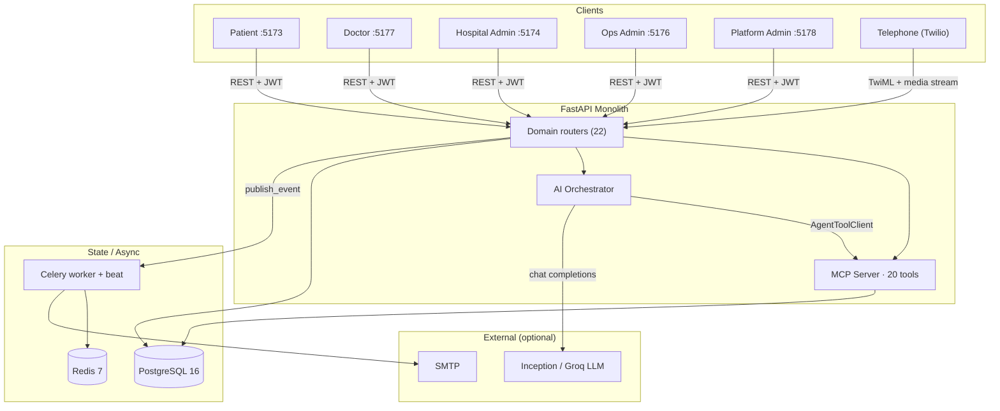

Every authenticated REST call follows the same path: CORS → correlation ID → JWT context (DB-reloaded) → role check → router → service → PostgreSQL / integration / event bus → response.

---

## Application Architecture

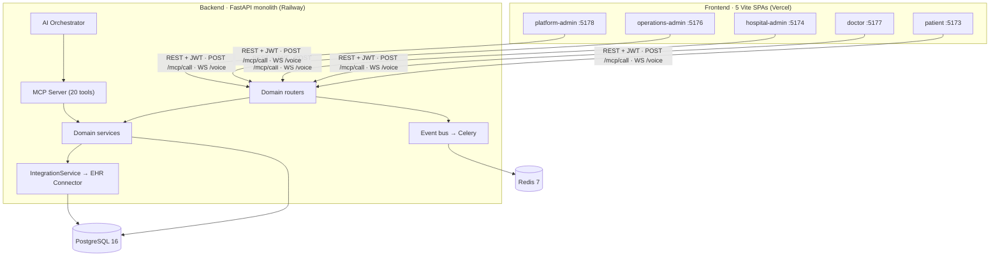

- **Patient** books and manages its own visits; patients may only book for their own `user_id` (enforced inside the write tool).
- **Doctor** manages personal agenda, availability, and completions; scoped to its hospital.
- **Hospital Admin** configures one hospital's catalog, doctors, and operations.
- **Platform Admin** is the sole role that bypasses hospital scoping, used for onboarding review and cross-tenant oversight.
- **Operations Admin** surfaces the same `/ops/*` recovery views for reconciliation/escalation handling.
- `frontend/shared/` is scaffolding only — nothing under `apps/*/src` imports it; each app owns its `api.ts`, context, and routes.

---

## Technology Stack

| Layer | Technology | Purpose |
|---|---|---|
| Frontend | React 18 + Vite 5 + TypeScript, react-router v7, axios, Tailwind 3, framer-motion, lucide-react | 5 role-scoped SPAs |
| Backend | FastAPI 0.115+, Pydantic v2, SQLAlchemy 2.0, Alembic | Modular monolith API (22 routers) |
| Database | PostgreSQL 16 + psycopg2 (SQLite only in tests) | Tenant-scoped transactional truth; 23 migrations (`0001–0023`) |
| Auth | PyJWT (HS256) + argon2-cffi, OAuth2PasswordBearer | Access (2 d) + refresh (2 d) tokens, RBAC, hospital tenancy |
| AI chat | httpx → Inception `mercury-2.5` (preferred) / Groq `openai/gpt-oss-20b` (fallback); custom in-process MCP (20 tools); Redis `AIContext` (TTL 2 h) | Tool-calling scheduling assistant (not RAG) |
| Voice | WebSocket (WebRTC) + Twilio media streams; Stub STT default, Groq Whisper optional; browser Web Speech TTS | Web + telephone channels |
| Async | Celery 5.4 + Redis broker/backend, Celery Beat (hourly sweep), supervisord | Workflow events, reminders, EHR retries |
| Integration | `EHRConnector` protocol + bundled Mock EHR | Swappable EHR stand-in with fault injection |
| Infra | docker-compose (local), Railway all-in-one container + Vercel SPAs (prod); no CI/CD | Dev / prod hosting |
| Observability | CorrelationIdMiddleware, `tracing.span`, audit + capability tables | Tracing, aggregate metrics, audit |
| Testing | pytest (30+ files, SQLite + TestClient, `TASK_EAGER`), Playwright e2e (`backend/tests/e2e`) | Unit/integration/AI/EHR/e2e verification |

---

## Frontend Architecture

```text
frontend/
├── apps/
│   ├── patient/            # :5173 — Home, Book, Visits, Inbox, Chat, ChatDebug, Voice, Preferences, Profile
│   ├── doctor/             # :5177 — Overview, Today, Upcoming, Calendar, Availability, AppointmentDetail, Questionnaires, Notifications, Profile
│   ├── hospital-admin/     # :5174 — Setup, Catalog, Doctors, Appointments, Questionnaires, AI activity, Integration, Workflows, Analytics, Staff, Ops
│   ├── operations-admin/   # :5176 — /ops/* recovery views only
│   └── platform-admin/     # :5178 — /platform/* oversight views
└── shared/                 # scaffolding only (not imported by apps)
    ├── api/
    └── ui/
```

- **Entry:** `index.html` → `src/main.tsx` → `src/App.tsx` (`BrowserRouter` → `Routes` → per-app auth guard → `<Navigate to="/login">`).
- **State:** React Context only (`AuthContext`, `AppStateContext` / `ScheduleContext` / `AdminStore`). No zustand/redux.
- **API:** per-app `src/api.ts` → `axios.create({ baseURL: VITE_API_URL ?? "https://careflow-ai-production.up.railway.app" })`; local dev uses `VITE_API_URL=http://localhost:8000`. `POST /mcp/call {tool, input}` backs search/availability helpers; voice derives its `wsBase` from `baseURL`.
- **Auth:** per-app `localStorage` token keys (e.g. `careflow_patient_token` + refresh); `Authorization: Bearer`; single silent refresh on 401 via `POST /auth/refresh`; boot restores via `GET /auth/me`; per-app role enforcement.
- **Voice loop (patient):** `voice/useWebRTCAudio.ts` (mic capture → `WS /voice/ws`) + `voice/useSpeechSynthesis.ts` (replies read aloud via browser `speechSynthesis`; no server TTS call).

Key routes: **patient** `/, /book, /visits, /inbox, /chat, /chat-debug, /voice, /preferences, /profile` · **doctor** `/, /today, /upcoming, /calendar, /availability, /appointments/:id, /questionnaires, /notifications, /profile` · **hospital-admin** `/, /setup, /catalog/*, /doctors, /appointments, /questionnaires, /ai-activity, /integration, /workflows, /analytics, /staff, /ops/*` · **operations-admin** `/ops/*` only · **platform-admin** `/platform/*`.

---

## Backend Architecture

`app/main.py` builds `FastAPI(title="CareFlow AI")`, adds CORS + `CorrelationIdMiddleware`, and mounts **22 routers**. Per-domain pattern: `router.py` (paths + `require_role` + `hospital_scoped_query`) → `service.py` (slot calc, state machine, lifecycle) → `models.py` + `schemas.py`. No separate repository layer; FK-only relationships.

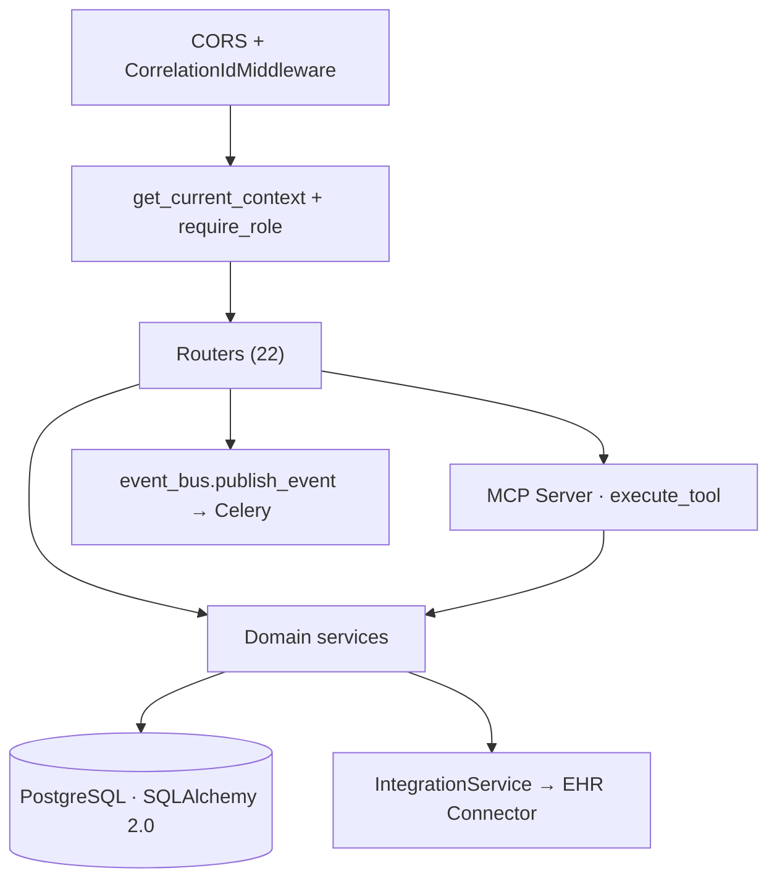

| Area | Endpoints |
|---|---|
| Auth | `POST /auth/register\|/login\|/refresh`, `GET /auth/me`, `GET /auth/platform-ping` |
| Appointments | `POST/GET /appointments`, `GET /appointments/{id}`, `POST .../reschedule\|/cancel\|/complete\|/no-show\|/confirm` |
| Scheduling | `GET/PUT /hospitals/{hid}/doctors/{did}/calendar`, `.../availability-rules[/{rid}]`, `.../blocked-slots[/{bid}]`, `GET .../slots` |
| Doctors / Hospitals | `GET/POST /hospitals/{id}/doctors` + lifecycle (`activate/deactivate/suspend/invite/login`); `POST /hospitals`; platform `POST /platform/hospitals/{id}/{approve,reject,suspend,reinstate,start-review,request-corrections}` |
| AI / MCP | `POST /chat`, `GET /mcp/tools`, `POST /mcp/call`, `GET /escalations`, `POST /escalations/{id}/resolve` |
| Ops | `GET /reconciliation/records`, `POST .../{id}/{retry,resolve}`, `GET /operations`, `POST /operations/{id}/retry`, `GET /workflows` |
| Observability | `GET /observability/trace/{cid}`, `GET /observability/metrics` |
| Voice | `WS /voice/ws`, `WS /voice/telephony/media`, `POST /voice/telephony/inbound` (TwiML) + `/status` |

Module map: `api/health` · `core/{config,security,deps,db,audit,tenant}` · `domain/{auth,appointment,doctor,hospital,hospital_config,patient,questionnaire,scheduling,directory}` · `integration/{connector_interface,integration_service,mock_ehr,mapping}` · `mcp_server/{server,escalations,tools×20,middleware}` · `ai/{router,agent/orchestrator,context,mcp_client}` · `notification` · `workflow/{event_bus,celery_app,tasks}` · `reliability/{verification,synchronization,reconciliation}` · `voice/{router,telephony,web_voice}` · `observability/{correlation,tracing,metrics}`.

---

## Database

PostgreSQL 16 (`Base` in `app/core/db.py`; `JSONB` with SQLite variant for tests), migrated with Alembic `0001–0023` (users → hospitals/audit → config/doctors → scheduling → preferences → mock EHR → appointments → reliability → MCP/agent → workflow → questionnaire → dashboards → telephony → observability → location/geo → lifecycle → durations → consultation mode → notifications-read → patient geo → hospital image → patient photo).

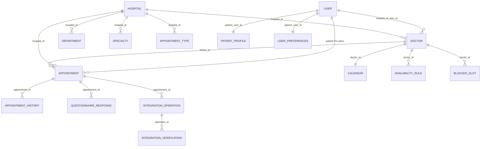

Key columns/constraints: `users(role: platform_admin|hospital_admin|doctor|patient, hospital_id nullable, is_active)` · `hospitals(status: draft/submitted/under_review/approved/rejected/suspended)` · `doctors(status: invited/active/inactive/suspended, external_provider_id)` · `patient_profiles(photo_url, nullable)` · `appointments(state: 10 values, idempotency_key unique, external_id, correlation_id; default pending)` · `appointment_history(from/to_state, actor)` · `notifications(dedupe_key unique)` · `capability_executions(tool, latency, correlation_id)` · `reconciliation_records(resolution_status: open/retrying/resolved/escalated)`.

---

## Authentication & Authorization

JWT (PyJWT, HS256) + Argon2. Access `{sub, role, hospital_id, type:access, exp=now+2d}`; refresh `{sub, type:refresh, exp=now+2d}`. `OAuth2PasswordBearer(tokenUrl="/auth/login")` → `get_current_context()` rejects non-`access` tokens, reloads the `User` row, rejects inactive → `require_role(*roles)` returns 403. No sessions, no SSO.

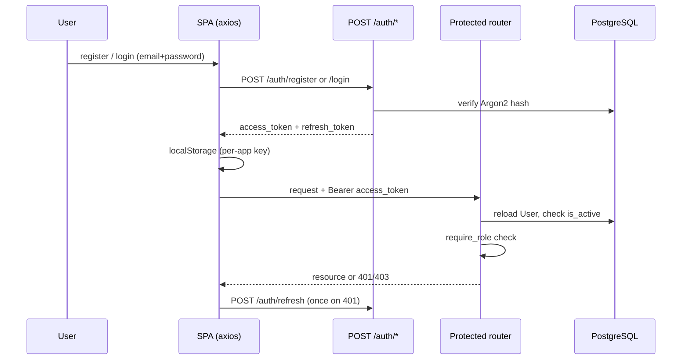

Multi-tenancy: the DB user row is authoritative — `get_current_context()` builds scope from the reloaded `User`, ignoring the token's `hospital_id` claim. `hospital_scoped_query()` filters every tenant query; only `platform_admin` bypasses. Registration enforces `hospital_id` required for hospital-scoped roles (`hospital_admin`, `doctor`) and forbidden otherwise.

---

## AI Architecture

Tool-calling agent — **not RAG**. A hand-rolled OpenAI-compatible tool loop (`MAX_ITERATIONS=8`) over chat-completions with function specs, deterministic pre/post-LLM guards, and structured `AIContext` memory. The 20 MCP tools: `search_hospitals`, `search_doctors`, `check_availability`, `get_day_schedule`, `lookup_patient`, `get_appointment`, `create_appointment`, `reschedule_appointment`, `cancel_appointment`, `get_questionnaire`, `list_appointment_types`, `submit_questionnaire`, `send_notification`, `start_workflow`, `get_context`, `update_preferences`, `verify_caller_identity`, `verify_external_appointment`, `synchronize_state`, `transfer_to_human`.

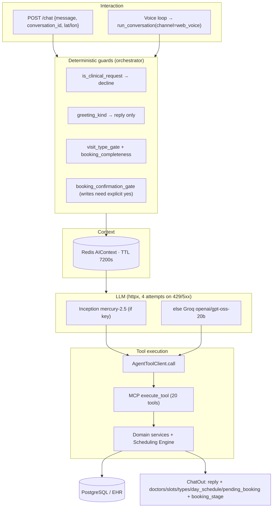

Capability boundary: the agent has **no database or EHR access**. Every tool call passes auth → idempotency (writes) → bounded retry (reads, EHR timeout/network/5xx) → audit (`capability_executions`). Write confirmation lives in the orchestrator's `_booking_confirmation_gate`; patients may only book for themselves; without LLM keys chat fails closed (502/503).

---

## Booking & Scheduling

Availability is computed from the doctor calendar + weekly availability rules − blocked slots − existing appointments, capped at `MAX_RANGE_DAYS=62`. Writes go through `scheduling.reserve_slot`: calendar `FOR UPDATE` lock + overlap check + `UNIQUE(doctor_id,start,end)` backstop → `SlotConflictError` → HTTP 409. Every transition writes `appointment_history` with correlation ID + actor. Async side effects (EHR write + verification, reminders) run in Celery via `publish_event()` — booking never waits on the bus.

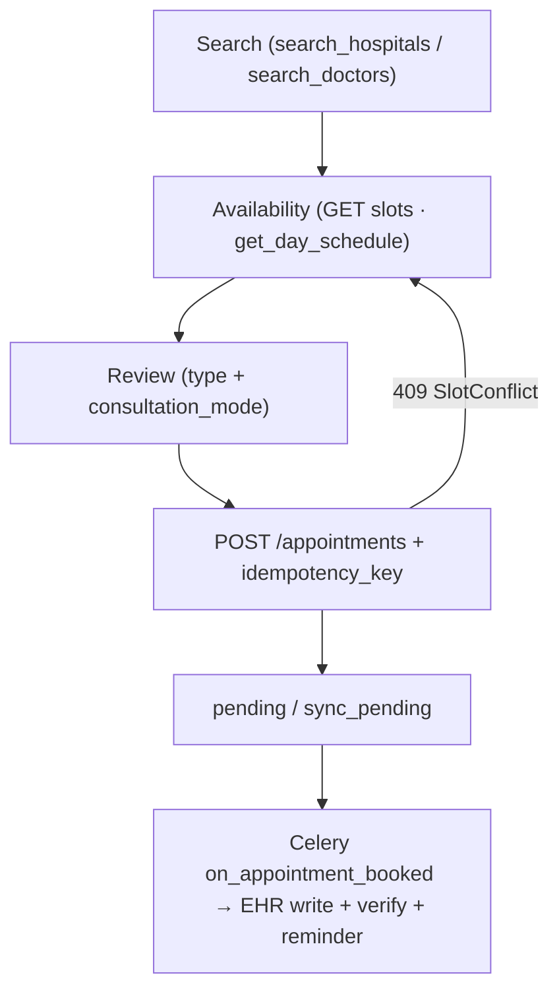

Appointment lifecycle (`AppointmentState`, 10 values):

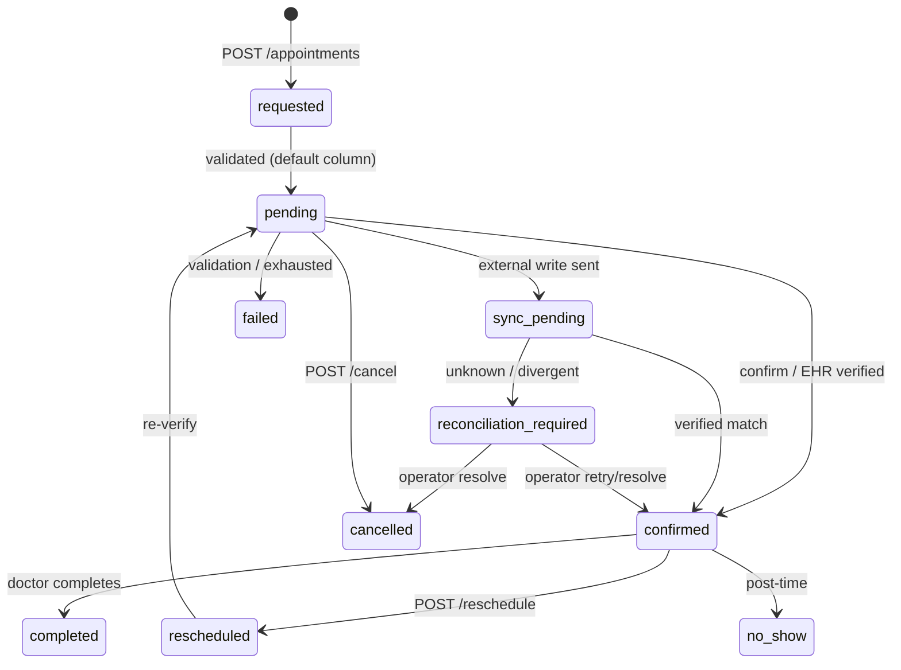

Trust-but-verify recovery: every vendor "success" is re-read before it counts; unknown outcomes look up by `idempotency_key` first, then park (`sync_pending` + open reconciliation record) or bounded-retry, escalating to `reconciliation_required` + operator retry/resolve. `EHRValidationError` (4xx) fails immediately, never retried.

---

## Application Screenshots

All screenshots below are the existing files in [`docs/images/`](docs/images/) — no placeholders. The repository currently contains patient and doctor screenshots only; there are no hospital-admin or platform-admin images checked in.

### Patient Application

**Home dashboard** — hero care search with location shortcut, quick actions, and upcoming appointment card.

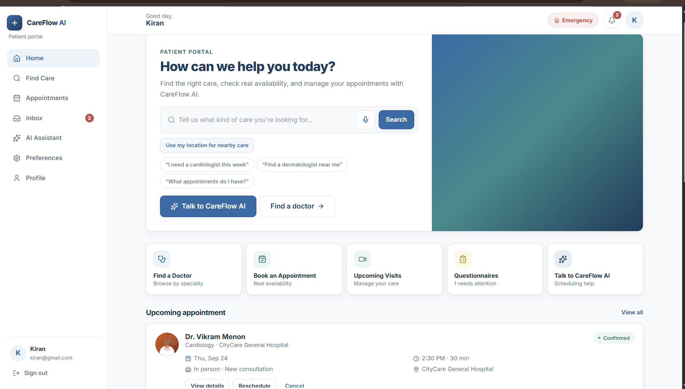

**Doctor and hospital discovery** — recommended care near the patient with availability shortcuts, hospital cards, and recent activity.

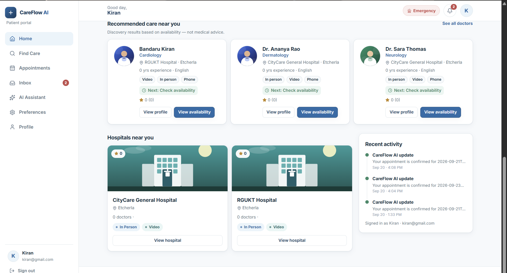

**AI Assistant chat** — conversational scheduling ("I need a cardiologist this week") with grounded doctor cards and Choose / View-availability actions.

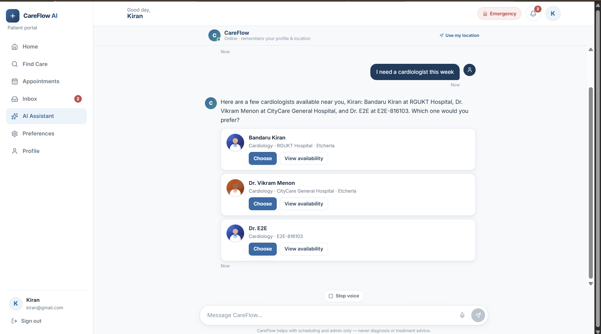

**Voice assistant** — live microphone session with transcript area, mute/start/demo-turn controls, and session-state indicators.

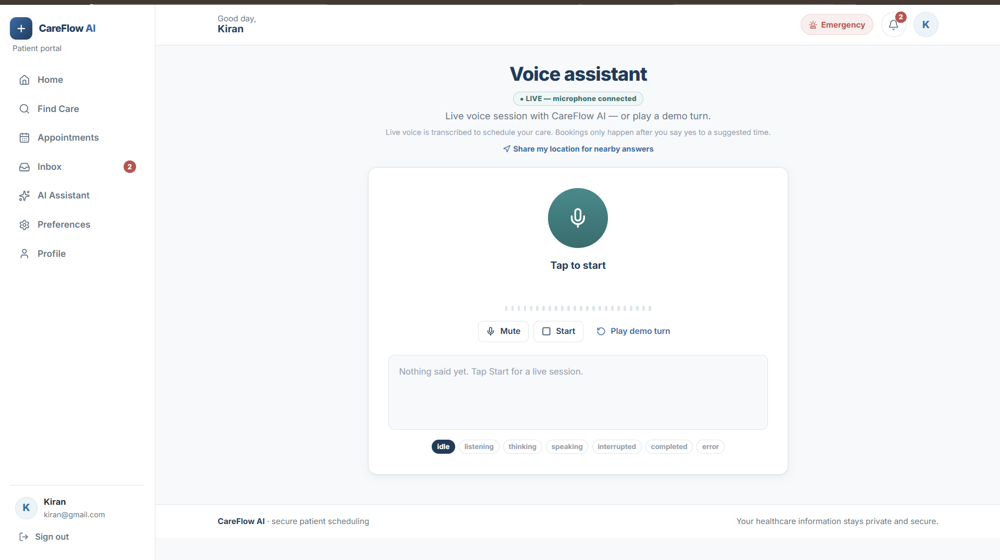

### Doctor Application

**Doctor overview** — today's load, next appointment, completion stats, today's schedule, and pre-visit form status.

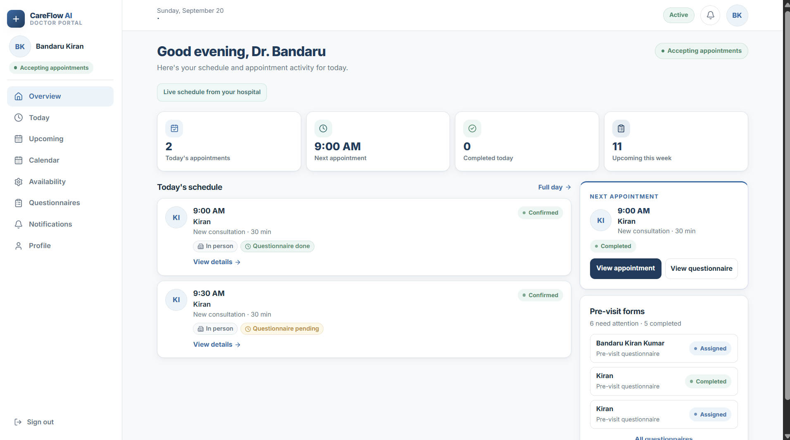

**Doctor calendar** — day picker, working-hours day schedule with appointment blocks, and click-empty-time-to-block.

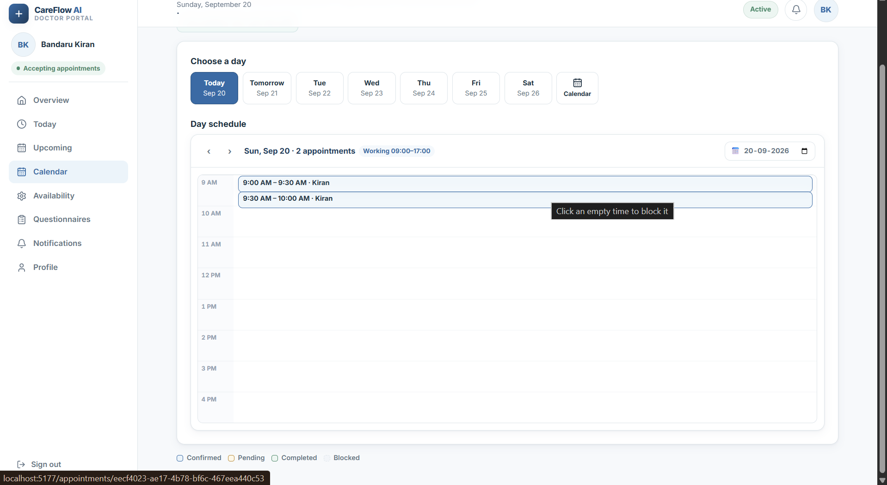

### Hospital Admin / Platform Admin

No screenshots for these applications are present in `docs/images/`; the live deployments linked above are the reference for their UI.

---

## Core User Flows

### Patient Booking Flow

1. Patient searches (home search, Find Care, or AI chat / voice) with optional geolocation.
2. `search_hospitals` / `search_doctors` return grounded candidates (specialty, mode, distance).
3. `check_availability` / `get_day_schedule` / `GET .../slots` show real slots (62-day window).
4. Patient picks type + consultation mode + time; AI builds `pending_booking` and states `missing_fields` one step at a time.
5. Explicit confirmation → `POST /appointments` with `idempotency_key` → 409 on race → `pending`/`sync_pending`.
6. Celery verifies against the EHR, sends reminders/notifications, and parks unknowns for operators.

### Doctor Workflow

Overview → Today/Upcoming agenda → appointment detail (confirm/complete/no-show) → review submitted questionnaires → manage calendar, availability rules, blocked slots → notifications/profile.

### Hospital Administration Workflow

Register hospital (`draft`) → complete setup (departments, specialties, appointment types) → submit → invite/activate doctors → operate (appointments, questionnaires, AI activity, integration, workflows, analytics, staff) → recover (failed/unknown/reconciliation/escalation/retry queues).

### Platform Administration Workflow

Review submitted applications (`under_review` → approve/reject/suspend/reinstate, request corrections) → monitor cross-hospital doctors/patients/appointments → inspect AI activity, integrations, workflows, analytics, audit, operational health.

Hospital onboarding states: `draft → submitted → under_review → approved (↔ suspended)`, `rejected → resubmitted`.

---

## API / Backend

High-level domain groups (see Backend Architecture table for the route inventory): `auth`, `appointment`, `scheduling`, `doctor`, `hospital` (+ `dashboard`, `platform`), `hospital_config`, `patient`, `questionnaire`, `directory`, `mock_ehr`, `ai` (`POST /chat`), `mcp_server` + `escalations`, `notification`, `workflow`, `observability`, `reliability`, `voice` + `telephony`. There is no OpenAPI/Swagger UI configured in `app/main.py`; the interactive docs are the default FastAPI `/docs` served by the framework when running locally.

---

## Project Structure

```text
CareFlow AI/
├── Architecture.md               # authoritative architecture reference
├── AI_USAGE_AND_TOOLS.md         # AI tools/models/prompts disclosure
├── architecture-design.md        # upstream stack authority
├── build-plan-deep-dive.md       # phase plan authority
├── docs/
│   ├── images/                   # 6 screenshots (patient ×4, doctor ×2)
│   ├── appointment-ai-current-state.md
│   └── opencode-prompts.md       # phased implementation record
├── backend/
│   ├── app/
│   │   ├── main.py               # FastAPI entrypoint, 22 routers
│   │   ├── core/                 # config, security, deps, db, audit, tenant
│   │   ├── domain/               # auth, appointment, doctor, hospital,
│   │   │                         # hospital_config, patient, questionnaire,
│   │   │                         # scheduling, directory
│   │   ├── ai/                   # router, agent/orchestrator, context, mcp_client
│   │   ├── mcp_server/           # server, 20 tools, middleware, escalations
│   │   ├── integration/          # connector interface, service, mock EHR
│   │   ├── reliability/          # verification, synchronization, reconciliation
│   │   ├── workflow/             # event bus, celery app, tasks, router
│   │   ├── voice/                # router, web_voice, telephony, STT/VAD/session
│   │   ├── notification/         # email (SMTP) + in-app, dedupe keys
│   │   ├── observability/        # correlation, tracing, metrics, router
│   │   └── api/                  # health
│   ├── alembic/versions/         # 0001–0023 migrations
│   ├── tests/                    # 30+ pytest files + e2e/ (Playwright)
│   ├── Dockerfile                # Railway all-in-one image
│   ├── railway.toml              # Dockerfile builder, /health check
│   ├── start.sh                  # DB normalize → wait → migrate → supervisord
│   └── requirements.txt
├── frontend/
│   ├── apps/                     # patient, doctor, hospital-admin,
│   │                             # operations-admin, platform-admin
│   └── shared/                   # scaffolding only
├── infra/
│   ├── docker-compose.yml        # postgres, redis, backend, hospital-admin,
│   │                             # doctor, worker, beat
│   └── docker-compose.alt-ports.yml
├── submission-docs/              # Architecture + AI usage PDFs
└── scripts/                      # PDF export helpers
```

---

## Local Development

### 1. Prerequisites

- Python 3.13, Node 18+, Docker + Docker Compose, PostgreSQL 16 + Redis 7 (or Docker to provide them).

### 2. Environment variables

Copy the examples (never commit `.env` — it is gitignored):

```bash
cp infra/.env.example infra/.env
cp backend/.env.example backend/.env   # optional local overrides
cp frontend/apps/patient/.env.example frontend/apps/patient/.env
```

Key variables (names only — no secrets are stored in the repo):

```env
DATABASE_URL=
REDIS_URL=
JWT_SECRET=
JWT_ALGORITHM=
ACCESS_TOKEN_EXPIRE_MINUTES=
REFRESH_TOKEN_EXPIRE_DAYS=
BACKEND_CORS_ORIGINS=
VITE_API_URL=
EHR_MOCK_BASE_URL=
SMTP_HOST=
SMTP_PORT=
SMTP_FROM=
INCEPTION_API_KEY=
INCEPTION_MODEL=
LLM_API_KEY=
LLM_MODEL=
STT_PROVIDER=
STT_MODEL=
TWILIO_ACCOUNT_SID=
TWILIO_AUTH_TOKEN=
TWILIO_PHONE_NUMBER=
TELEPHONY_STREAM_URL=
TASK_EAGER=
```

LLM/STT/Twilio keys are optional: chat fails closed without LLM keys, STT defaults to `stub`, and the telephony webhook returns 503 when `TELEPHONY_STREAM_URL` is empty.

### 3. Database setup

Via compose (creates `careflow` DB on `postgres:16-alpine`), or point `DATABASE_URL` at a local Postgres. Migrations run automatically in the container entrypoint:

```bash
alembic upgrade head
```

### 4. Backend setup

```bash
cd backend
pip install -r requirements.txt
uvicorn app.main:app --reload --port 8000
```

Health check: `GET http://localhost:8000/health`.

### 5. Frontend setup (per app)

```bash
cd frontend/apps/patient   # or doctor | hospital-admin | operations-admin | platform-admin
npm install
npm run dev                # Vite on :5173 / :5177 / :5174 / :5176 / :5178
```

Each app reads `VITE_API_URL` (defaults to `http://localhost:8000` in `.env.example`, with a production Railway fallback compiled in).

### 6. Running individual applications

| App | Dev port | Command dir |
|---|---|---|
| Patient | 5173 | `frontend/apps/patient` |
| Hospital Admin | 5174 | `frontend/apps/hospital-admin` |
| Operations Admin | 5176 | `frontend/apps/operations-admin` |
| Doctor | 5177 | `frontend/apps/doctor` |
| Platform Admin | 5178 | `frontend/apps/platform-admin` |

### 7. Docker setup

See [Docker](#docker) below. If ports clash, use the alt-ports override (`8001/6380/5179+`):

```bash
cd infra
docker compose -f docker-compose.yml -f docker-compose.alt-ports.yml up -d --build redis backend
```

---

## Docker

- `backend/Dockerfile` (`python:3.13-slim` + `redis-server` + `supervisor` + `curl`) → `CMD ./start.sh`: normalizes `DATABASE_URL` (incl. Neon `channel_binding` strip), boots embedded Redis when needed, TCP-waits Postgres, retries `alembic upgrade head` 10×, then supervisord (or bare uvicorn when `ALL_IN_ONE=false`).
- `infra/docker-compose.yml`: `postgres:16-alpine` + `redis:7-alpine` + `backend` (API only, `ALL_IN_ONE=false`) + `hospital-admin` + `doctor` + `worker` (`celery worker --concurrency=2`) + `beat`. The patient SPA was removed from compose — run it via local `npm run dev`.
- Each frontend app ships its own `Dockerfile` + `vercel.json` (SPA rewrite to `/index.html`).

```bash
cd infra
docker compose up -d --build
docker compose logs -f backend worker beat
```

---

## Testing

| Suite | Framework / location | Run |
|---|---|---|
| Backend (30+ files: auth, scheduling, appointments, double-booking, lifecycle, reliability, workflow, questionnaire, dashboards, voice, telephony, MCP/agent, observability, geo, dashboards…) | pytest, SQLite + `TestClient`, eager Celery + in-memory AI context (no Redis needed) | `cd backend && pytest` |
| Booking-state determinism (45 tests) | `backend/tests/test_booking_state.py` | `pytest tests/test_booking_state.py` |
| Categorized suites | `backend/tests/{unit,integration,ai,ehr}/` | `pytest tests/unit tests/integration tests/ai tests/ehr` |
| E2E (`happy_path_spec`, `failure_recovery_spec` + `seed.ts`) | Playwright + Chromium headless, `backend/tests/e2e/` | `cd backend/tests/e2e && npm install && npx playwright test` |
| Frontend typecheck + build | `tsc --noEmit && vite build` per app | `npm run build` in `frontend/apps/<app>` |

Documented suite sizes grew per phase (up to 376+ passing) in `docs/opencode-prompts.md`.

Test environment: the suite is self-contained — `backend/tests/conftest.py` forces Celery eager mode and the in-memory AI-context store, so `pytest` needs no running Redis, Postgres, or LLM keys (LLM calls are scripted/monkeypatched; the vendor EHR is stubbed). A full run takes ~6 minutes. The Playwright E2E specs additionally need the live stack (backend + frontend dev servers + Redis) described above.

### First-run demo accounts (no seed script — create in order)

1. Register the first `platform_admin` via `POST /auth/register` (allowed only while no platform admin exists — deployment bootstrap; later attempts return 403).
2. Register a hospital via `POST /hospitals` (creates the hospital as `submitted` plus its first `hospital_admin` login).
3. Approve it as platform admin (`POST /platform/hospitals/{id}/approve`), then configure catalog, doctors, calendars, and availability from the Hospital Admin app.
4. Self-register `patient` accounts via `POST /auth/register` (patients and doctors are the only self-registerable roles; `hospital_admin` must come from hospital registration or `POST /hospitals/{id}/staff`).

### Voice provider requirements

- Web voice works out of the box for capture/VAD/streaming UI, but transcription defaults to a stub that hears nothing: set `STT_PROVIDER=groq` plus `LLM_API_KEY`/`GROQ_API_KEY` for real Groq Whisper transcription.
- Spoken replies on web are browser speech synthesis (no key needed). There is no server-side TTS — the telephone path therefore has no voice output until a TTS provider is wired (`StubTTS` raises by design).
- The AI chat/telephone agent needs an LLM key (`INCEPTION_API_KEY` preferred, Groq fallback); without one, chat fails closed (503) and telephony cannot converse.

---

## Deployment

- **Frontend (Vercel):** the four [Live Applications](#live-applications) above, each with SPA rewrites (`vercel.json`). Operations Admin is not publicly deployed.
- **Backend (Railway):** all-in-one container from `backend/Dockerfile` (`railway.toml`: Dockerfile builder, `healthcheckPath=/health`, restart `ON_FAILURE×10`) — `supervisord` runs uvicorn + Celery worker + Celery beat; embedded `redis-server` fallback when `REDIS_URL` is unset; Railway Postgres/Redis via `DATABASE_URL`/`REDIS_URL`. CORS allowlist (`BACKEND_CORS_ORIGINS`) covers the Vercel URLs.
- **Local (compose):** split layout per `infra/docker-compose.yml` (`ALL_IN_ONE=false` + dedicated worker/beat).
- **No CI/CD** — no `.github/workflows` exists in the repository.

---

## Documentation

- [`Architecture.md`](Architecture.md) — implementation-grounded architecture reference (primary).
- [`AI_USAGE_AND_TOOLS.md`](AI_USAGE_AND_TOOLS.md) — AI tools, runtime models/providers, prompts, RAG non-use statement.
- [`docs/API.md`](docs/API.md) — source-grounded API reference (routers, auth, scoping, chat/MCP/voice); machine-readable source is `/openapi.json`.
- [`docs/SETUP.md`](docs/SETUP.md) — local setup (prereqs, env, DB, backend/frontend, ports, alt-ports).
- [`docs/DEPLOYMENT.md`](docs/DEPLOYMENT.md) — Railway all-in-one backend, Vercel SPAs, compose split layout, migration requirements.
- [`docs/TESTING.md`](docs/TESTING.md) — backend pytest, frontend build, Playwright e2e.
- [`docs/AI_EVAL.md`](docs/AI_EVAL.md) — AI evaluation entrypoint (intended use, tool allowlist, guards, fail-closed behavior, limitations).
- [`SECURITY.md`](SECURITY.md) — implemented security model (JWT/Argon2, RBAC, tenancy, secrets, reporting).
- [`CONTRIBUTING.md`](CONTRIBUTING.md) — actual contributor workflow (setup, tests, migrations, PR expectations).
- [`CHANGELOG.md`](CHANGELOG.md) — unreleased development snapshot from git history (no formal releases).
- [`docs/opencode-prompts.md`](docs/opencode-prompts.md) — verbatim phased implementation record.
- [`docs/appointment-ai-current-state.md`](docs/appointment-ai-current-state.md) — read-only AI-path audit (no LangGraph).
- [`architecture-design.md`](architecture-design.md) / [`build-plan-deep-dive.md`](build-plan-deep-dive.md) — upstream design and phase plan.
- [`submission-docs/`](submission-docs/) — PDF exports of the architecture and AI-usage documents.
- [`prompt.txt`](prompt.txt) — Figma/Figma Make design brief (input brief only).

---

## Security Considerations

Implemented (verified in code — not a claim of production-hardening; see [`SECURITY.md`](SECURITY.md) for the full model):

- Argon2 password hashing; JWT HS256 access + refresh (2 d / 2 d); per-request DB user reload with inactive rejection; no sessions/SSO.
- Self-registration is limited to `patient` (and `doctor` bound to a hospital); `hospital_admin` is provisioned only via hospital registration/staff invite, and `platform_admin` only via first-user bootstrap — direct self-registration of privileged roles returns 403.
- `require_role()` on routers; `allowed_roles` on all 20 MCP tools (denied calls still audited); patient self-booking constraint in write tools.
- Observability trace/metrics require an operator role; hospital admins see only their own hospital's data, platform admins the global view.
- Hospital tenancy via `hospital_scoped_query`; token `hospital_id` treated as a hint only; `platform_admin` sole bypass.
- CORS allowlist; Pydantic validation on every router/tool input; email validation; phone digit-normalization; Twilio HMAC-SHA1 check when token configured.
- Orchestrator confirmation gate on booking writes; `idempotency_key` required on writes + DB unique backstop; slot reservation under `FOR UPDATE` lock; EHR writes verified before confirm.
- Secrets via env only (`pydantic-settings`); `.env` files gitignored; only `.env.example` files checked in.

---

## Future Improvements

Grounded gaps/TODOs (kept concise; unfinished items are not presented as complete):

- No CI/CD pipeline exists — add build/test/migration-gated deploys.
- No hospital-admin or platform-admin screenshots in `docs/images/` — capture and document those UIs.
- Server-side TTS was removed (Groq Orpheus decommissioned); the WS/telephone pipeline retains only a `StubTTS` interface — a supported voice model would complete the telephone loop.
- `frontend/shared/` is unused scaffolding — either adopt it for cross-app components or remove it.
- Operations Admin has no public deployment — decide whether to deploy it or fold `/ops/*` fully into hospital-admin.
- Test stack uses SQLite while production is PostgreSQL — consider Postgres-backed integration runs for lock/concurrency paths (`FOR UPDATE`, unique backstops).

---

## Contributors / Author

Per git history, the repository is maintained by **bkk07** (`180952443+bkk07@users.noreply.github.com`) on `main`. See commit history for per-phase contributions.

---

## License

MIT — see [`LICENSE`](LICENSE). Third-party dependencies remain under their own licenses (see `backend/requirements.txt` and `frontend/apps/*/package.json`).
